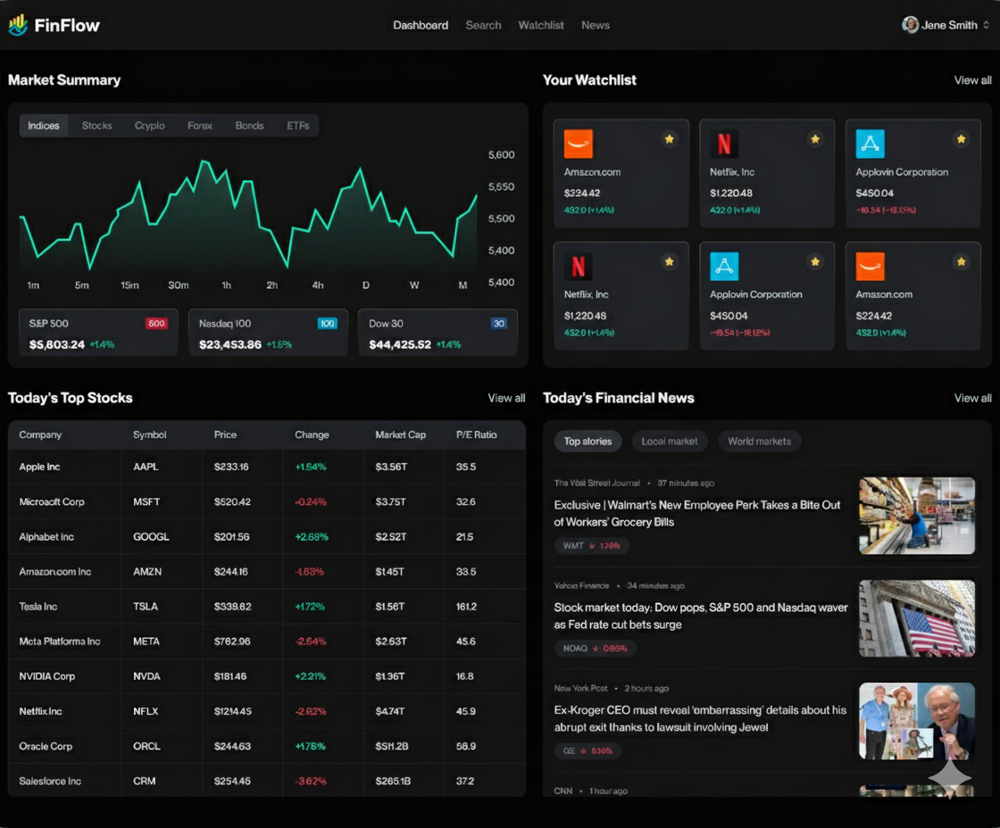

# FinFlow

A modern financial dashboard built with Next.js, featuring stock watchlists, real-time news, and automated email summaries.

## Features

- **Stock Watchlist**: Add and manage your favorite stocks with real-time data
- **Search Functionality**: Search for stocks with integrated watchlist status
- **Personalized News**: Get curated financial news based on your watchlist
- **Automated Emails**: Receive daily news summaries via email with AI-powered insights
- **User Authentication**: Secure sign-in and sign-up with Better Auth

## Screenshots



## Getting Started

### Prerequisites

- Node.js (v18 or higher)
- MongoDB
- Finnhub API key
- Gemini AI API key

### Installation

1. Clone the repository:
   ```bash
   git clone https://github.com/CodeWithDubeyji/FinFlow.git
   cd FinFlow
   ```

2. Install dependencies:
   ```bash
   npm install
   ```

3. Install Inngest:
   With the Next.js app now running, open a new tab in your terminal. In your project directory's root, run the following command to install Inngest SDK:
   ```bash
   npm install inngest
   ```

4. Set up environment variables (create `.env`):
   ```
   MONGODB_URI=your_mongodb_connection_string
   NEXT_PUBLIC_FINNHUB_API_KEY=your_finnhub_api_key
   GEMINI_API_KEY=your_gemini_api_key
   BETTER_AUTH_SECRET=your_better_auth_secret
   BETTER_AUTH_BASE_URL=http://localhost:3000
   NODEMAILER_EMAIL=your_email@example.com
   NODEMAILER_PASSWORD=your_email_password
   ```

5. Run the development server:
   ```bash
   npm run dev
   ```

6. Run the Inngest Dev Server:
   Next, start the Inngest Dev Server, which is a fast, in-memory version of Inngest where you can quickly send and view events and function runs:
   ```bash
   npx inngest-cli@latest dev
   ```
   In your browser open http://localhost:8288 to see the development UI.

7. Open [http://localhost:3000](http://localhost:3000) in your browser.

## Contributing

1. Fork the repository
2. Create a feature branch: `git checkout -b feature-name`
3. Make your changes and commit: `git commit -m 'Add some feature'`
4. Push to the branch: `git push origin feature-name`
5. Open a pull request

## License

This project is licensed under the MIT License.
